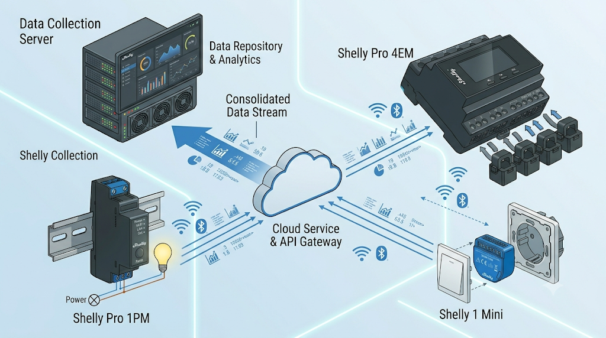

# shelly-exporter

A lightweight Go daemon that polls [Shelly](https://www.shelly.com) devices over HTTP and writes selected metrics to [InfluxDB 2.x](https://www.influxdata.com/products/influxdb/).  
Runs as a single static binary or a Docker container. Configuration lives in a JSON file that is **hot-reloaded** whenever it changes on disk.

## Goal
I could not find a suitable, local exporter for Shelly devices that directly stores metrics into InfluxDB for Grafana visualization. Existing solutions often rely on rigid environment-based configurations and lack the flexibility to select specific device metrics—frequently limiting data collection to real-time power consumption only.

This project provides a highly flexible, easy-to-use alternative that allows full control over configuration and metric selection.

## License & Responsibility

This is a personal, vibe-coded project tailored for local home automation environments. It is provided "as-is" without any explicit warranty or guarantee of stability, security, or ongoing maintenance. 
Feature requests and bug reports are welcome via the repository's issues page.

---

## Features

| | |
|---|---|
| **Device support** | Gen1 (Shelly1, Shelly2, ShellyPlug, ShellyEM, Shelly3EM, ShellyBulb, ShellyRGBW, ShellyDimmer, H&T, Door/Window, Flood, …) and **Gen2 / Gen3** (Plus/Pro series, Shelly BLU gateway) via automatic generation detection |
| **Metrics** | Power, voltage, current, power-factor, energy, relay state, input state, brightness, temperature, humidity, battery %, roller position |
| **Selective collection** | Per-device `metrics` list – or `"all"` to collect everything |
| **Per-device interval** | Independent polling cadence per device (seconds) |
| **Config hot-reload** | No restart needed – edit `config.json` and scrapers restart automatically |
| **InfluxDB 2.x** | Async writes with built-in error logging; also compatible with InfluxDB 1.8 via the compatibility endpoint |
| **HTTP auth** | Optional per-device Basic Auth for password-protected devices |
| **Structured logging** | JSON logs to stderr, configurable level (`debug` / `info` / `warn` / `error`) |
| **Minimal image** | Multi-stage Docker build; final image is `scratch` (~7 MB) |

---

## Quick start with Docker Compose

```bash
# 1. Copy the example config and customise it
cp config.example.json config.json

# 2. Start InfluxDB + shelly-exporter together
docker compose up -d
```

InfluxDB UI will be available at <http://localhost:8086>  
(default credentials: `admin` / `adminpassword`, org `myorg`, bucket `shelly`).

---

## Build the image manually

```bash
docker build -t shelly-exporter .
```

Run the container, mounting your config file:

```bash
docker run -d \
  --name shelly-exporter \
  --restart unless-stopped \
  -e CONFIG_PATH=/etc/shelly-exporter/config.json \
  -v /path/to/your/config.json:/etc/shelly-exporter/config.json:ro \
  shelly-exporter
```

---

## Run without Docker

```bash
go build -o shelly-exporter .
CONFIG_PATH=./config.json ./shelly-exporter
```

---

## Configuration reference

The exporter reads a single JSON file. The path is set via the `CONFIG_PATH` environment variable (default: `/etc/shelly-exporter/config.json`).

### Top-level fields

| Field | Type | Required | Description |
|---|---|---|---|
| `influxdb` | object | ✅ | InfluxDB connection settings (see below) |
| `log_level` | string | | Log verbosity: `debug`, `info`, `warn`, `error`. Default: `info` |
| `devices` | array | ✅ | List of Shelly devices to scrape |

### `influxdb` object

| Field | Type | Required | Description |
|---|---|---|---|
| `url` | string | ✅ | InfluxDB base URL, e.g. `http://influxdb:8086` |
| `token` | string | ✅ | InfluxDB API token. For v1 compat use `username:password` |
| `org` | string | | Organisation name. Leave empty for InfluxDB 1.8 compat |
| `bucket` | string | ✅ | Bucket (v2) or database (v1 compat) to write into |
| `measurement` | string | | Legacy setting (ignored). Measurements are device names. |

### `devices` array item

| Field | Type | Required | Description |
|---|---|---|---|
| `name` | string | ✅ | Written as the `device` tag in InfluxDB. Use a unique, descriptive slug |
| `address` | string | ✅ | Device IP address or hostname (no scheme). E.g. `192.168.1.101` |
| `interval` | integer | | Polling interval in seconds. Default: `30` |
| `metrics` | array | | Metric keys to collect (see table below). Use `["all"]` for everything. Default: all |
| `username` | string | | HTTP Basic Auth username (if device auth is enabled) |
| `password` | string | | HTTP Basic Auth password |

### Available metric keys

| Key | Unit | Description |
|---|---|---|
| `power` | W | Active power |
| `voltage` | V | RMS voltage |
| `current` | A | RMS current |
| `pf` | — | Power factor (0–1) |
| `energy` | Wh¹ | Cumulative energy counter |
| `relay_state` | 0/1 | Relay / switch output state |
| `input_state` | 0/1 | Digital input state |
| `temperature` | °C | Device or sensor temperature |
| `humidity` | % | Relative humidity (H&T sensors) |
| `brightness` | % | Light brightness (dimmers, bulbs) |
| `battery` | % | Battery charge level |
| `roller_position` | % | Roller/cover position (0 = closed, 100 = open) |

Multi-channel devices (e.g. Shelly 2PM) append a channel suffix to the field name: `power_ch0`, `power_ch1`.  
Energy-meter phases are suffixed `phase0`, `phase1`, `phase2`.

> ¹ Gen1 standard meters (`meters[]`) report energy in **Watt-minutes**; Gen1 energy meters (`emeters[]`) and all Gen2 devices report in **Wh**.

---

## Example config

```json
{
  "influxdb": {
    "url": "http://influxdb:8086",
    "token": "my-super-secret-token",
    "org": "myorg",
    "bucket": "shelly"
  },
  "log_level": "info",
  "devices": [
    {
      "name": "living_room_plug",
      "address": "192.168.1.101",
      "interval": 30,
      "metrics": ["power", "voltage", "current", "relay_state", "temperature"]
    },
    {
      "name": "kitchen_dimmer",
      "address": "192.168.1.102",
      "interval": 15,
      "metrics": ["relay_state", "brightness"]
    },
    {
      "name": "energy_meter",
      "address": "192.168.1.103",
      "interval": 10,
      "metrics": ["all"]
    },
    {
      "name": "protected_device",
      "address": "192.168.1.104",
      "interval": 60,
      "username": "admin",
      "password": "secret",
      "metrics": ["power", "relay_state"]
    }
  ]
}
```

---

## Logging

All log output is written to **stderr** as JSON so it appears in `docker logs`:

```bash
docker logs -f shelly-exporter
```

Example output:

```json
{"time":"2024-01-15T10:30:00Z","level":"INFO","msg":"config loaded","devices":3,"log_level":"info"}
{"time":"2024-01-15T10:30:00Z","level":"INFO","msg":"scraper started","device":"living_room_plug","address":"192.168.1.101","interval":"30s"}
{"time":"2024-01-15T10:30:01Z","level":"DEBUG","msg":"scraped metrics","device":"living_room_plug","count":5}
{"time":"2024-01-15T10:30:01Z","level":"ERROR","msg":"scrape failed","device":"kitchen_dimmer","error":"HTTP GET http://192.168.1.102/shelly: dial tcp ..."}
```

Set `"log_level": "debug"` in the config to see every scrape and every InfluxDB write.

---

## Hot-reload

Edit `config.json` at any time. The exporter detects the change via filesystem events, validates the new file, and restarts all device scrapers automatically. If the new file is invalid, the old config stays active and an error is logged.

---

## InfluxDB data model

```
measurement: <name from config>
fields:
  power_ch0          = 12.5
  voltage_ch0        = 230.1
  relay_state_ch0    = 1.0
  temperature        = 44.2
  ...
timestamp: <scrape time>
```

Example Flux query for a device's power over the last hour:

```flux
from(bucket: "shelly")
  |> range(start: -1h)
  |> filter(fn: (r) => r._measurement == "living_room_plug")
  |> filter(fn: (r) => r._field == "power_ch0")
```

---

## Supported devices (tested / documented APIs)

| Device | Gen | Notes |
|---|---|---|
| Shelly1, Shelly1PM | 1 | Single relay, optional power metering |
| Shelly2, Shelly2.5 | 1 | Dual relay or roller mode |
| ShellyPlug, ShellyPlug S | 1 | Single relay + power metering |
| Shelly4PM | 1 | Quad relay + per-channel metering |
| ShellyEM | 1 | 2-phase energy meter |
| Shelly3EM | 1 | 3-phase energy meter |
| ShellyBulb, ShellyRGBW2 | 1 | Dimmable/colour lights |
| ShellyDimmer, ShellyDimmer2 | 1 | Trailing-edge dimmers |
| Shelly H&T | 1 | Temperature + humidity sensor |
| Shelly Door/Window, Flood | 1 | Battery-powered sensors |
| Shelly Plus 1, Plus 1PM | 2 | Single relay, optional metering |
| Shelly Plus 2PM | 2 | Dual relay + metering, roller mode |
| Shelly Pro 4PM | 2 | Quad relay + metering |
| Shelly Plus Plug S | 2 | Single relay + metering |
| Shelly Plus H&T | 2 | Temperature + humidity + battery |
| Shelly Pro EM, Pro 3EM | 2 | Single/3-phase energy meters |

Any device that implements the standard Gen1 `/status` or Gen2 `/rpc/Shelly.GetStatus` API will work; generation is detected automatically.

---

## License

MIT
